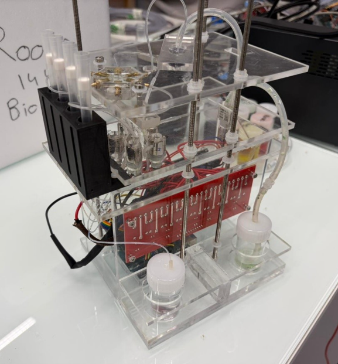

# Immunostaining Controller
**LadHyX · Ecole Polytechnique**

An automated immunostaining system controlled via an Arduino Uno and a Python desktop GUI. The system sequences reagent delivery, incubation, washing, and vacuum steps automatically, with all parameters configurable from the GUI before each experiment.

Supervisors: Abdul Barakat, Claire Leclech

---

## Files

| File | Description |
|------|-------------|
| `immunostaining_arduino.ino` | Arduino firmware — upload this to the board |
| `immunostaining_gui.py` | Python GUI — run this on your computer |

---

## Requirements

### Hardware
- Arduino Uno R3
- 8-channel relay shield (30VDC / 3A per channel)
- 6× CJWP08-AB03A11 3.3V DC mini diaphragm pumps
- 20×4 I2C LCD display (address `0x27`)
- 1× push button (connected to pin D8)
- Type-C power delivery module
- PTFE tubing (OD 1.07 mm / ID 0.56 mm)
- Custom 6-port manifold (5 inlets, 1 outlet)



### Software
- [Arduino IDE](https://www.arduino.cc/en/software) (to upload the firmware)
- Python 3.7 or later
- `pyserial` library:
```bash
pip install pyserial
```

---

## Setup Instructions

### Step 1 — Upload the Arduino firmware
1. Open `immunostaining_arduino.ino` in the Arduino IDE.
2. Connect the Arduino to your computer via USB.
3. Select the correct board: **Tools → Board → Arduino Uno**.
4. Select the correct port: **Tools → Port → COMx** (Windows) or `/dev/ttyUSBx` (Linux/Mac).
5. Click **Upload**.
6. Once uploaded, **close the Serial Monitor** if it is open — it must be closed before running the Python GUI.

### Step 2 — Install Python dependencies
```bash
pip install pyserial
```

### Step 3 — Run the GUI
```bash
python immunostaining_gui.py
```

---

## Using the GUI

### Connecting to the Arduino
1. From the **Port** dropdown, select the port your Arduino is connected to (e.g. `COM4` on Windows, `/dev/ttyUSB0` on Linux/Mac).
2. Click **Connect**.
3. Wait 2–3 seconds for the connection to stabilise (the Arduino resets when a serial connection is opened).
4. The indicator will show **● Connected** in green when ready.

### Configuring the experiment

#### Reagent Volumes (mL)
Set the volume to be delivered for each reagent:

| Field | Pump | Default |
|-------|------|---------|
| Fixation | Pump 1 | 0.60 mL |
| Permeabilization | Pump 3 | 0.60 mL |
| Antibody 1 | Pump 4 | 0.60 mL |
| Antibody 2 | Pump 5 | 0.60 mL |
| Wash | Pump 2 | 0.80 mL |

#### Wash Cycles
Set how many times the wash + vacuum cycle repeats after each reagent step. A cleaning tubes step is always performed at the end of each wash cycle regardless of this value.

#### Incubation Times (seconds)
Set the incubation duration after each reagent delivery:

| Field | Description |
|-------|-------------|
| After Fixation | Time to wait after fixation reagent is delivered |
| After Permeabilization | Time to wait after permeabilization reagent |
| After Antibody 1 | Time to wait after primary antibody delivery |
| After Antibody 2 | Time to wait after secondary antibody delivery |

> **Tip:** For real biological experiments, typical incubation times are on the order of minutes to hours. Enter the value in seconds (e.g. 1800 for 30 minutes).

### Running the sequence
1. Set all volumes, wash cycles, and incubation times.
2. Click **Set Volumes** to send the parameters to the Arduino. Confirm the acknowledgement appears in the Serial Log.
3. Click **▶ Start** to begin the automated sequence.
4. The **Sequence Progress** section will show the current step and a countdown timer.
5. To interrupt the sequence at any time, click **■ Stop** — all pumps will be turned off immediately.

### Sequence order
The system executes the following steps automatically:

```
Fixation → Incubation → Wash cycle(s) →
Permeabilization → Incubation → Wash cycle(s) →
Antibody 1 → Incubation → Wash cycle(s) →
Antibody 2 → Incubation → Wash cycle(s) →
End
```

Each wash cycle consists of:
```
Vacuum → Wash → (repeat n times) → Cleaning tubes → Vacuum
```

### Physical button
The sequence can also be started directly by pressing the button on the device, using the last parameters that were sent by the GUI (or the default values if the GUI has never been connected).

---

## Pin Mapping

| Pump | Role | Arduino Pin | Relay | Flow Rate |
|------|------|-------------|-------|-----------|
| Pump 1 | Fixation | D2 | IN1 | 0.927 mL/min |
| Pump 2 | Wash | D3 | IN2 | 1.040 mL/min |
| Pump 3 | Permeabilization | D4 | IN3 | 0.787 mL/min |
| Pump 4 | Antibody 1 | D5 | IN4 | 0.986 mL/min |
| Pump 5 | Antibody 2 | D6 | IN5 | 1.044 mL/min |
| Pump 6 | Vacuum/Drain | D7 | IN6 | 31.20 mL/min |

---

## Serial Communication Protocol

The GUI communicates with the Arduino using plain text commands over USB serial at **9600 baud**.

| Command | Direction | Description |
|---------|-----------|-------------|
| `VOL:v1,v2,v3,v4,v5,n,t1,t2,t3,t4` | GUI → Arduino | Set volumes (mL), wash cycles, and incubation times (s) |
| `START` | GUI → Arduino | Begin the staining sequence |
| `STOP` | GUI → Arduino | Immediately halt all pumps |
| `ACK:volumes_received` | Arduino → GUI | Confirms parameters were received |
| `SEQ:start` | Arduino → GUI | Sequence has begun |
| `STEP:<label>,<ms>` | Arduino → GUI | Current step name and duration in ms |
| `DONE` | Arduino → GUI | Current step has finished |
| `SEQ:end` | Arduino → GUI | Sequence complete |
| `ACK:stopped` | Arduino → GUI | All pumps halted |

---

## Troubleshooting

| Problem | Solution |
|---------|----------|
| Port not listed in GUI | Click **Refresh** or check the USB cable |
| Cannot connect to port | Make sure the Arduino Serial Monitor is closed in the IDE |
| GUI connects but Arduino does not respond | Wait 3 seconds after connecting — the Arduino resets on serial open |
| Pumps do not start | Check relay shield connections and power supply |
| Progress bar does not update | Check serial log for `STEP:` messages; verify the Arduino firmware was uploaded correctly |
| Wrong volume delivered | Re-run pump calibration and update flow rates in the firmware |

---

## Notes
- The flow rates in the firmware are empirically calibrated for the CJWP08-AB03A11 pumps. If pumps are replaced, recalibrate by running each pump for one minute and measuring the delivered volume.
- The microchip should be kept in a light-isolated environment during the antibody incubation steps to prevent interference with fluorescent signals.
- All connections use M4 fasteners for easy disassembly and maintenance.
